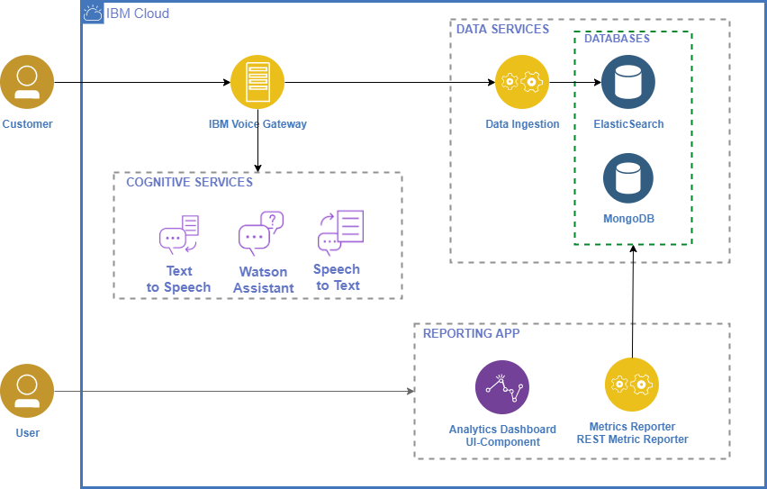

# Metric's REST Server for IVG Dashboard
The present repository consists of the backend code of an IVG's dashboard project developed in Chile. It's a node.js's express server, which is connected to a ElasticSearch database (in where the logs of IVG's are indexed) and to a MongoDB (which is in charge of users authentication). As a optional feature, if the dashboard is deployed on a Kubernetes enviroment, it would retrieve health information through API calls to the cluster. 
There are mainly 5 controllers groups:
- **auth**: responsible of authenticate the requests.
    - Authorization grant by a JWT Bearer Token
- **conversations**: responsible of obtaining the conversational logs of Watson Assistant to retrieve the user's interactions.
    - List of calls by time range
    - Call detail by conversationID (inputs/outputs)
    - Audio of call by ID (audios are assumed to be storage on /recordings path of host)
- **reports**: responsible of obtaining CDR logs of Voice Gateway to retrieve general calls information.
    - Amount of calls by time range
    - Average Latency (Watson Assistant + STT + TTS) by time range
    - Intents: Most frequent intents by time range
    - Average call duration by time range
    - Average setup time by time range
- **kubernetes** (if deployed on K8s): responsible of communiacation with the K8s cluster to retrieve health of the pod's.
    - Get pods detail with label=vgw-dashboard
- **users**: responsible of the comunication with the MongoDB to manage user information.
    - Add user
    - Edit user
    - Remove user

## Architecture



## Enviroment variables
Basi enviroment variables:
```sh
ES_HOST: Elasticsearch Host. Default https://elasticsearch:9200.  (Required)
ES_CDR_INDEX: Index of call detail record documents. Defaults to 'cdr' (Optional)
ES_CONV_INDEX: Index of conversations documents. Defaults to 'conv'. (Optional)
K8s_NAMESPACE: Namespace of deployments on Kubernetes. Defaults to 'default'(Optional)
MONGODB_URI: Mongo Host. Defaults to https://mongodb:27017. (Required)
```

If audios are being storaged on a IBM Cloud Object Storage, the following variables are needed:
```sh
COS_ACCESSKEYID: 
COS_ENDPOINT: 
COS_IBMAUTHENDPOINT: 
COS_SECRETACCESSKEY: 
COS_SERVICEINSTANCEID: 
```

## Installation of dependencies
```sh
npm install
```

## Ejecución de la aplicación
### Dessarrollo
```sh
npm run development
```

### Producción
```sh
npm start
```


## TODO
1. Implementar autenticación.
2. Tests.
3. Manejo de errores.
4. Validación de parametros.

## Contributors
- [Ignacio Acuña](https://github.ibm.com/Ignacio-Acuna-Frias)
- [Jose Valdebeneito](https://github.ibm.com/Jose-Valdebenito)
- [Stefano Gioia](https://github.ibm.com/Stefano-Gioia)